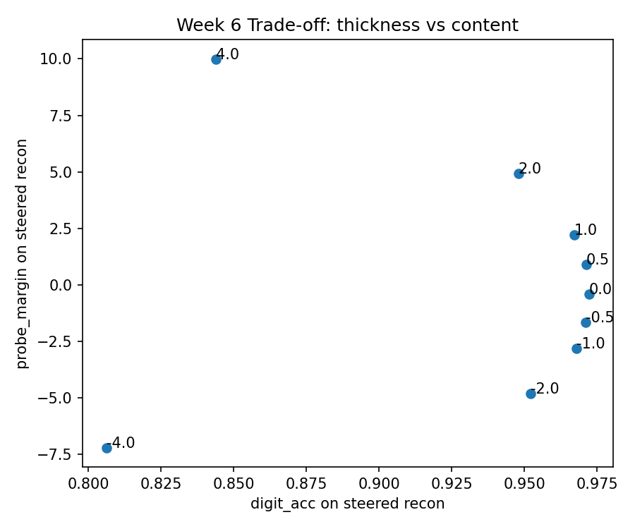
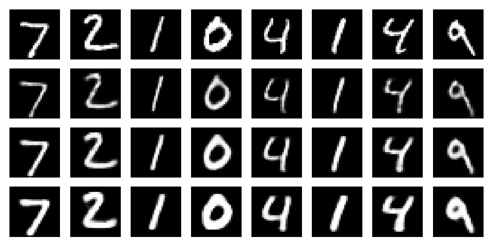

# Weekly Update (Week 6)

## 1. Memo:

**Global Steering Direction for Stroke Thickness Control**

This week, I implemented global latent steering for stroke thickness control using a 16-dimensional latent space in a Conv-VAE trained on MNIST. The direction was estimated from 25,600 paired latent vectors representing thickened and thinned augmentations, and the augmentation settings were: `thin_k=1`, `thick_k=1`, and `blend=0.2`. The experiment evaluated the effect of steering on the probe score for thickness and digit classification accuracy.

Key results:
1. **Sanity Check**: The mean ink gap between thick and thin augmentations (`ink_gap_mean = 0.1868`) was positive, confirming that thickness was meaningfully controlled by the augmentations.
2. **Global Latent Direction**: The learned direction for thickness control was stable and aligned with changes in stroke thickness.
3. **Trade-off**: Positive steering (`α > 0`) consistently increased thickness (probe margin) with minimal loss in digit accuracy, with the best trade-off observed for `α = 0.5–1.0`. Larger values (`|α| ≥ 2`) produced stronger effects but noticeably reduced content preservation (digit accuracy).
4. **Performance Summary**:
   - `orig_digit_acc = 0.9909`
   - `a = 0.5` → `digit_acc = 0.9712` (very small loss)
   - `a = 1.0` → `digit_acc = 0.9671` (small loss)
   - `a = 4.0` → `digit_acc = 0.8439` (significant loss)

Next steps:
- Compare the learned direction with other alternatives (PCA or class-conditional).
- Test larger steering values and their perceptual effects.

---

## 2. Results Table (CSV)

The results table below summarizes the evaluation of `α` values and their impact on digit classification accuracy and probe margin (thickness).

| Condition      | Digit Accuracy | Probe Margin | Probe P-Thick | Digit Acc Drop vs Orig | Probe Margin Gain vs Recon |
|----------------|----------------|--------------|---------------|------------------------|---------------------------|
| orig           | 0.9909         | -0.407       | 0.320         | 0.0000                 | 0.0000                    |
| recon_orig     | 0.9722         | -0.035       | 0.527         | 0.0187                 | 0.0000                    |
| aug_thin       | 0.9691         | -1.096       | 0.242         | 0.0218                 | 1.0614                    |
| aug_thick      | 0.9618         | 1.433        | 0.673         | 0.0291                 | 1.6861                    |
| steer_a=-4.0   | 0.8063         | -7.213       | 0.0048         | 0.1846                 | 8.2417                    |
| steer_a=-2.0   | 0.8425         | -4.811       | 0.073         | 0.1484                 | 5.2966                    |
| steer_a=-1.0   | 0.8589         | -2.808       | 0.213         | 0.1320                 | 3.9764                    |
| steer_a=-0.5   | 0.8769         | -1.647       | 0.320         | 0.1140                 | 2.8595                    |
| steer_a=0.5    | 0.9712         | 0.889        | 0.573         | 0.0010                 | 1.2968                    |
| steer_a=1.0    | 0.9671         | 2.221        | 0.696         | 0.0051                 | 2.6283                    |
| steer_a=2.0    | 0.9479         | 4.925        | 0.880         | 0.0243                 | 5.3321                    |
| steer_a=4.0    | 0.8439         | 9.998        | 0.991         | 0.1283                 | 9.9994                    |

---

## 3. Key Plots

- **Trade-off: `Probe Margin` vs `Digit Accuracy`** (showing how `α` affects both the thickness control and content preservation).

  

- **Steering Preview** (showing a visual example of how stroke thickness increases with `α` values).

  

---

## 4. Next Week Plan:

- **Objective**: Improve thickness control while preserving digit identity.
- **Steps**:
  1. Compare global direction learned here with PCA or class-conditional methods for better attribute control.
  2. Test larger values of `α` (greater than 4) to see perceptual limits for this type of steering.
  3. Investigate if class-conditional latent steering can provide more targeted control over thickness without degrading content preservation.
  4. Apply additional sanity metrics like **stroke length** (for consistency) and evaluate the impact of different latent models.

---

## 5. Risks / Limitations:

- The **current steering direction** might be too simplistic for complex or varied data, especially if the dataset contains a diverse set of writing styles.
- **Steering large values** (`α ≥ 2`) may cause **overfitting** to specific thickness characteristics without properly generalizing across the dataset.
- The **content preservation** trade-off is still **subjective**; better metrics for human evaluation (e.g., perceptual similarity) could improve understanding of how digit identity is affected by thickness variations.
